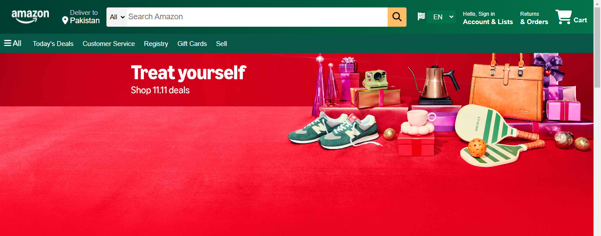
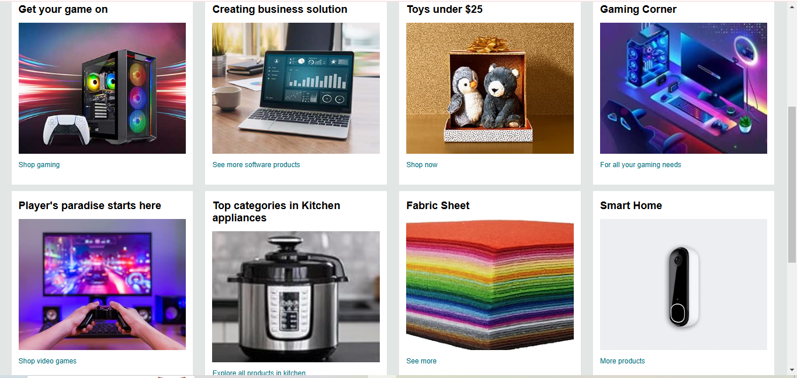
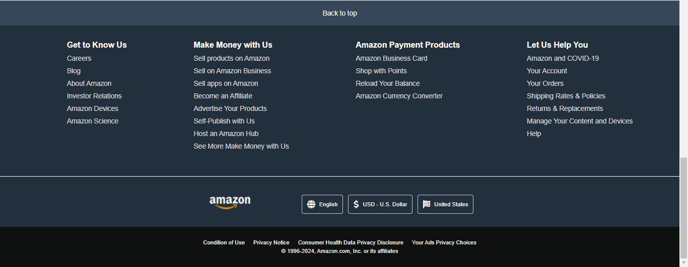

# Amazon Clone

An Amazon clone project created from scratch using core HTML and CSS. This project aims to demonstrate fundamental web development skills by replicating the design and layout of Amazon's main pages.

## 🌟 Features

- **Home Page Layout:** The main page layout mirrors Amazon's familiar interface, offering a recognizable and user-friendly experience.
- **Responsive Design:** Built with CSS media queries to ensure responsiveness across devices.
- **Clean Code Structure:** Organized HTML and CSS files for easy navigation and readability.

## 🛠️ Technology Stack

- **HTML** - For the structure and layout
- **CSS** - For styling and responsiveness

## 🚀 Live Demo

Check out the live version deployed on Vercel: [Your Vercel Link](https://your-vercel-link)

## 📸 Screenshots

### Hero Section

### Product Section

### Footer Section

## 📈 Future Improvements

- Add interactivity with JavaScript
- Implement dynamic product listings with data

## 💡 Inspiration

This project is inspired by Amazon's user interface, focusing on practicing HTML/CSS fundamentals and developing an e-commerce front-end layout.

## 📝 Acknowledgments

A huge thank you to my mentor **Sir Ameen Alam** for his guidance and motivation throughout this project.

---

### License

This project is licensed under the MIT License - see the [LICENSE](LICENSE) file for details.

---

## 📫 Contact

Feel free to reach out if you have suggestions, feedback, or if you’d like to collaborate on similar projects.

[LinkedIn](https://www.linkedin.com/in/muhammad-kashif7016) | [GitHub](https://github.com/Muhammadkashif5)
